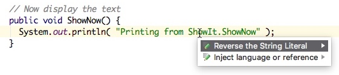

---
StringReversal Quick Start Guide
---

StringReversal is an Intention Action plugin for the IntelliJ Platform. The plugin provides IntelliJ users with the ability to reverse the contents of a literal string. The plugin's functionality is exposed when the editor caret is placed within a literal string and the user presses the Alt+Enter keys:



## Structure
The plugin was developed using the [IntelliJ Platform SDK](http://www.jetbrains.org/intellij/sdk/docs/basics/getting_started/using_dev_kit.html). The main components are:
#### The [Plugin Configuration File](../main/resources/META-INF/plugin.xml) 
This XML file provides meta information to the IntelliJ application about the StringReversal plugin, such defining the `intentionAction` and `project-component`.
```xml
  <extensions defaultExtensionNs="com.intellij">
    <intentionAction>
      <className>com.intellij.sdk.StringReversal.ConditionalStringReverser</className>
      <category>Java/Strings</category>
      <descriptionDirectoryName>ConditionalStringReverser</descriptionDirectoryName>
    </intentionAction>
  </extensions>
```
* Note that the Intention Action is declared within `extension` tags rather than in the `actions` tags. 
* Like an action description, the `className` tag must be a fully qualified class name for IntelliJ to identify the class. 
* The `category` tag specifies the language (Java) and function (String) categories for listing in the IntelliJ Intentions Preferences Panel.
* The `descriptionDirectoryName` tag specifies the name of the directory that holds the Intention Action description files.
#### The [ConditionalStringReverser.java](../main/java/src/com/kineticsnw/StringReversal/ConditionalStringReverser.java) Class
This class implements the `IntentionAction` class, the basis for Intention Actions. The `ConditionalStringReverser` class provides the string-reversing functionality by means of callback methods to the IntelliJ application. Of particular importance:
* `ConditionalStringReverser.isAvailable()` is called when IntelliJ is assembling the list of Intention Actions to display to the user. It is the responsibility of this method to determine if the StringReversal Intention Action is applicable to the current caret position. If not, IntelliJ will not include StringReversal in the list of Intention Actions. 
* `ConditionalStringReverser.invoke()` is called when the user selects StringReversal from the list of Intention Actions. It is the responsibility of this method to actually make the changes to a Java string literal by reversing it within the IntelliJ representation of the Java source file. 
### The Intention Description Files
The description files supply the plugin documentation for display within the IntelliJ Intentions Preferences Panel. Note the optional use of the ```<spot>``` tags to highlight how the code snipped will be changed by StringReversal.
* [description.html](https://github.com/jhake/public/blob/master/java/StringReversal/src/intentionDescriptions/ConditionalStringReverser/description.html) provides a short description of plugin functionality.
* [before.java.template](https://github.com/jhake/public/blob/master/java/StringReversal/src/intentionDescriptions/ConditionalStringReverser/before.java.template) provides a short code snippet showing some Java literal strings in the state **before** StringReverser is applied.
* [after.java.template](https://github.com/jhake/public/blob/master/java/StringReversal/src/intentionDescriptions/ConditionalStringReverser/after.java.template) shows the same code snippet in the state **after** StringReverser is applied.
## Function
When the StringReversal plugin is [deployed](http://www.jetbrains.org/intellij/sdk/docs/basics/getting_started/deploying_plugin.html) in IntelliJ IDEA, the Plugin Configuration File registers StringReversal at IntelliJ startup. When IntelliJ IDEA startup completes and the editor is used on an open project file:
#### IntelliJ Provides Context to `ConditionalStringReverser.isAvailable()` 
This method begins to get calls from IntelliJ that contain information about the context of the caret position. 
* If the caret context is correct - a literal string expression - the `isAvailable()` method returns `true`. This is determined by examining the PsiTokenType of the PsiElement provided to `isAvailable()` as a method argument.
* As a result the user will see StringReversal in the Intention Action list when the Alt+Enter keys are pressed. (See image above.)
* If the user selects the Intention Action "Reverse the String Literal" from the Intention Actions list, then the `ConditionalStringReverser.invoke()` method is called.
#### Intellij Calls `ConditionalStringReverser.invoke()`
* This method is called to reverse the string by manipulating the PsiElement under the caret.
* Reversing the literal string is accomplished by first using `PsiTreeUtil` to get the _parent_ of the PSIElement provided as a method argument. The _parent_ is a `PsiLiteralExpression` element, containing the literal string.
* The string is acquired from the _parent_ and reversed using the `StringBuilder` class.
* The `PsiElementFactory` for the project is accessed via the `JavaPsiFacade` class as well as the `project` object provided as a method argument.
* The factory is used to create a new `PsiLiteralExpression` element in the context of the _grandparent_ of the PsiElement provided as a method argument, and containing the reversed string.
* The existing _parent_ element's replace() method is used to substitute the new `PsiLiteralExpression` in the PsiTree for the existing _parent_ element.
* The replacement happens in the context of an IntelliJ _write action_, which wraps the Intellij call to `invoke()`. The write action context means the change happens as a transaction, and supports undo functionality.
## Additional Resources
* Build and review the JavaDocs for the StringReverser plugin.
* Use the Psi structure viewer explore the Psi tree for a Java source file before and after using the StringReverser Intention Action.
* Review the [video overview](https://youtu.be/2nJMPpguJhg) of the StringReveral Intention Action Plugin
